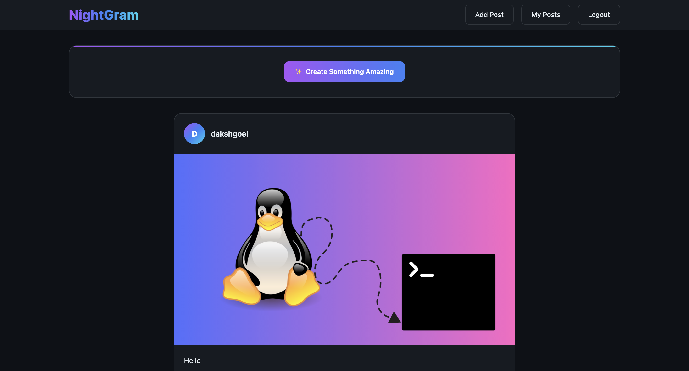
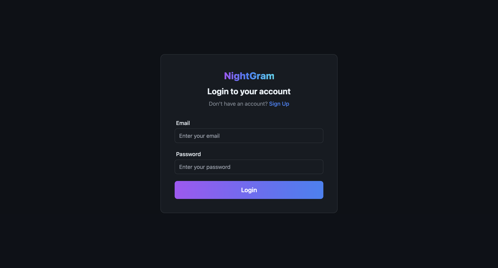
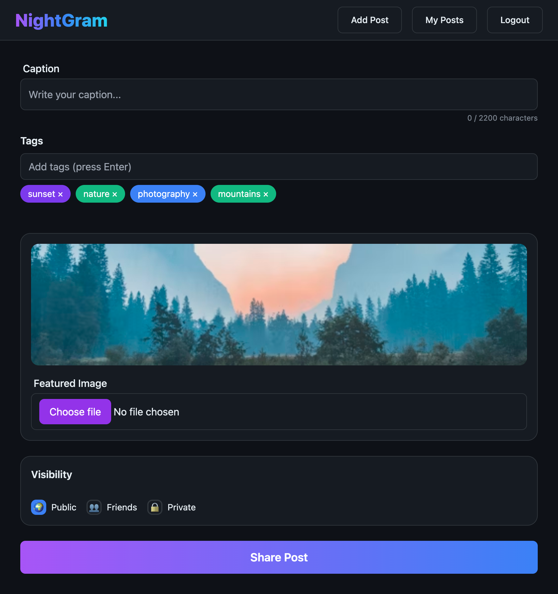
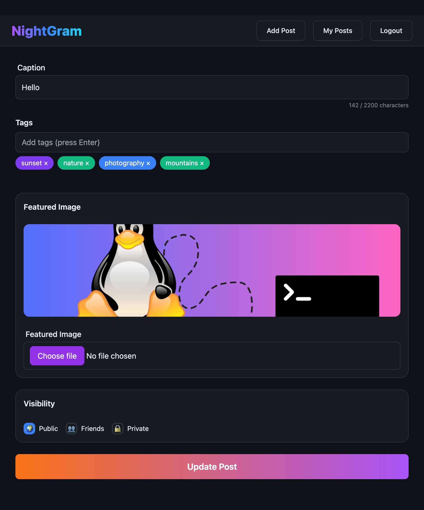
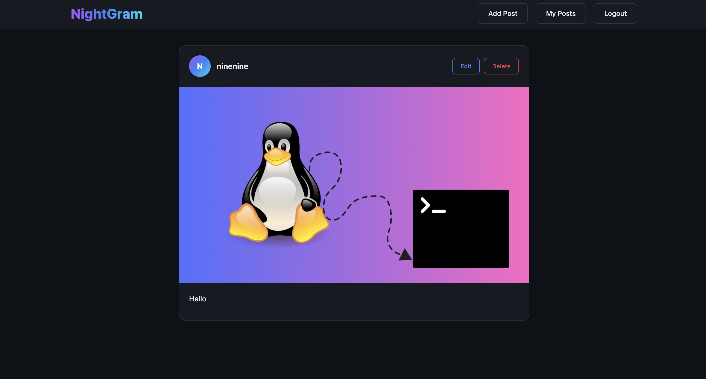

# NightGram

Welcome to **NightGram** – a modern Instagram clone built with React, Redux Toolkit, Appwrite, and Tailwind CSS.  
Share your moments, explore posts, and experience a sleek, dark-themed social platform!

---

## 🚀 Features

- 🔐 **Authentication**: Sign up, log in, and log out securely (powered by Appwrite)
- 📝 **Create Posts**: Share your thoughts and images with the world
- 🖼️ **Image Uploads**: Upload and display images in your posts
- 🏠 **Home Feed**: Browse all posts from the community
- 👤 **My Posts**: View and manage your own posts
- ✏️ **Edit & Delete**: Update or remove your posts anytime
- 🎨 **Dark UI**: Stylish, responsive design with Tailwind CSS

---

## 🛠️ Tech Stack

- React (with Hooks)
- Redux Toolkit
- Appwrite (Auth, Database, Storage)
- React Router v7
- Tailwind CSS
- Vite

---

## ⚡ Getting Started

1. **Clone the repo:**
   ```sh
   git clone https://github.com/Daksh700/NightGram.git
   ```

2. **Install dependencies:**
   ```sh
   npm install
   ```

3. **Configure Appwrite:**
   - Create a `.env` file (see `.env.sample`) and fill in your Appwrite credentials:
     ```
     VITE_APPWRITE_URL=...
     VITE_APPWRITE_PROJECT_ID=...
     VITE_APPWRITE_DATABASE_ID=...
     VITE_APPWRITE_COLLECTION_ID=...
     VITE_APPWRITE_BUCKET_ID=...
     ```

4. **Run the app:**
   ```sh
   npm run dev
   ```

---

## 📁 Project Structure

```
src/
  appwrite/         # Appwrite service wrappers (auth, database, storage)
  components/       # Reusable UI components
  pages/            # Page components (Home, Login, Signup, etc.)
  store/            # Redux slices and store
  conf/             # App configuration
  assets/           # Static assets
  App.jsx           # Main app logic
  main.jsx          # Entry point
```

---

## 📸 Screenshots









---

## 🙏 Credits

- [Appwrite](https://appwrite.io/)
- [Tailwind CSS](https://tailwindcss.com/)
- [Unsplash](https://unsplash.com/) (for demo images)

---

> Made with ❤️ for learning and fun.
